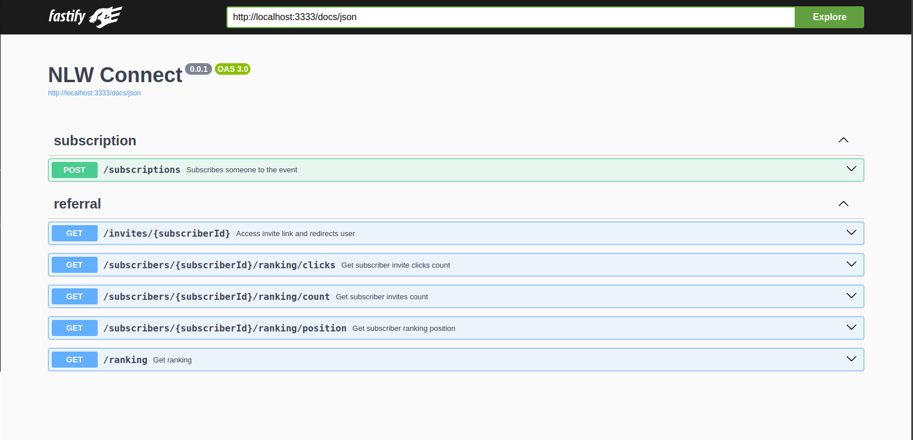

<p align="center"> 
  <h1 align="center">Sistema de Indicação Completo <span>Desenvolvido com 💜</span></h1>
  
  <p align="center">
    Sistema completo de indicação com frontend moderno e API robusta
  </p>

  <p align="center">
    
  </p>

  <p align="center">
    
  </p>

  <p align="center">
    
  </p>

  <h1 align="center">Sobre</h1>
  
  Este é um sistema completo de indicação/indicações, composto por uma interface web moderna e uma API robusta. O sistema permite que usuários façam indicações, acompanhem seu desempenho em tempo real e visualizem rankings.

## ✨ Features Principais

### Frontend
- Interface moderna e responsiva
- Dashboard com estatísticas
- Ranking em tempo real
- Sistema de links de indicação
- Design otimizado para mobile

### Backend
- API REST completa
- Sistema de convites por link
- Ranking em tempo real
- Contagem de cliques
- Cache com Redis
- Documentação Swagger

## 💻 Tecnologias

### Frontend
- [React](https://react.dev/)
- [TypeScript](https://www.typescriptlang.org/)
- [Tailwind CSS](https://tailwindcss.com/)
- [Next.js](https://nextjs.org/)

### Backend
- [Node.js](https://nodejs.org/)
- [Fastify](https://www.fastify.io/)
- [PostgreSQL](https://www.postgresql.org/)
- [Redis](https://redis.io/)
- [Drizzle ORM](https://orm.drizzle.team/)
- [Docker](https://www.docker.com/)

## 🚀 Como Executar

### Pré-requisitos
- Docker e Docker Compose
- Node.js 18+
- NPM ou Yarn

### Configurando o Backend

1. Entre na pasta do servidor:
```bash
cd server
npm install
cp .env.example .env
npm run dev
```

### Configurando o Frontend

1. Entre na pasta web:
```bash
cd web
npm install
cp .env.example .env
npm run dev
```

<!-- ## 📱 Screenshots

<p align="center">
  
  
  
</p> -->

## 📂 Estrutura do Projeto

```
connect/
  ├── server/           # Backend da aplicação
  │   ├── src/
  │   │   ├── drizzle/
  │   │   ├── functions/
  │   │   ├── redis/
  │   │   └── routes/
  │   └── README.md
  │
  ├── web/             # Frontend da aplicação
  │   ├── src/
  │   │   ├── app/
  │   │   ├── components/
  │   │   └── http/
  │   └── README.md
  │
  └── README.md
```

## 🔗 Links Importantes

- [Documentação da API](http://localhost:3333/docs)
- [Frontend Demo](https://connect-web.vercel.app)

## ✒ Author

<p align="center">
  

  <h3 align="center">André de Souza</h3>
  
  <p align="center">  
    Feito com amor e fé para não desistir 😅, entre em contato!
  </p>
</p>  
  
<div align="center">

[](https://www.linkedin.com/in/andredessilva/)
[](mailto:seutecdev@gmail.com)
[](https://github.com/andreoew)

</div> 